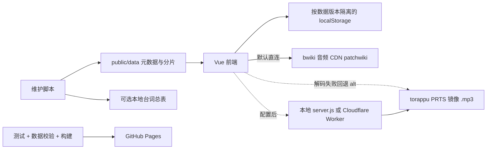

# 《明日方舟配音猜干员》交接文档

> 版本：v2.3（音频主源换成 bwiki CDN + 逐条语音对应关系复核）
> 更新日期：2026-09-24
> 本文描述当前本地代码；域名、DNS、线上部署状态需要在实际发布时另行确认。

## 1. 项目与资产归属

- 核心仓库：`https://github.com/CoConuts-Milk0325/voice-guess-arknights.git`
- 配置的正式站点：`https://voice-guess-arknights.coconutsmilk.top`
- 前端：Vue 3 + Vite；生产静态托管配置为 GitHub Pages。
- 当前数据：431 名干员、32,022 条语音记录（其中 31,864 条以 bwiki 为音频主源，158 条因源站缺单元格或串档而保留 PRTS；不代表唯一音频文件数量）。运行 `npm run verify:data` 获取当前数量。

**工作区根目录不是 Git 仓库。生产代码仓库在 `voice-guess/`。**

| 路径 | 归属与用途 |
|---|---|
| `voice-guess/` | 生产 Git 仓库：前端、音频代理、更新脚本、数据分片 |
| `HANDOVER.md`、`docs/` | 工作区文档，不会随 `voice-guess` 的提交自动保存；需要单独备份 |
| `voice-line-search/` | 本地 BM25 台词检索工具，包含独立测试和台词总表 |
| 根目录 `voice-texts.json` | 可选台词总表副本；不再是生产仓库校验的必需依赖 |
| `arknights-wordle/` | 独立参考仓库；批次更新脚本会在文件存在时同步其干员元数据 |
| `视频/` | 宣传音频素材 |
| `voice-guess-deploy/`、三个旧 zip | 历史部署备份；当前构建产物是 `voice-guess/dist/` |
| `.superpowers/`、`.wrangler/` | 开发记录或工具状态；清理前确认是否仍有需要保留的记录 |



## 2. 本地开发

使用 Node.js 24（与 CI 一致）及 npm。先安装依赖：

```powershell
cd voice-guess
npm ci
```

| 模式 | 命令 | 说明 |
|---|---|---|
| 热更新开发 | `npm run dev` | Vite，默认端口 5173，音频默认直连 CDN |
| 构建预览 | `npm run build` 后 `npm run preview` | Vite Preview，默认端口 4173 |
| 本地代理 | 修改音频配置后 `npm run build`，再 `node server.js` | 提供 `dist/` 和 `/audio/*`；默认端口 5173，冲突时递增 |

`start.bat` 启动的是 Vite，并且会强制结束占用 5173 的进程；一般优先使用 `npm run dev`。

### 2.1 启用本地音频代理

音频调用链是 `AudioPlayer.vue → audioLoader.js → config.js → constants.js`。`getAudioUrl()` 按条目前缀选源：`bwiki:` 走 `patchwiki.biligame.com`（默认源），无前缀或 `prts:` 走 torappu 并把 `.wav` 换成同名 `.mp3`；条目上的 `alt` 是另一家的同一句录音，网络或解码失败时由 `AudioPlayer.vue` 回退一次。

`server.js` 只代理 PRTS 源，不能缓存 BWiki 主源。若要让 PRTS 主源与备用音频经过本地缓存，可在 `src/config.js` 中保留现有 `split`、`resolve`，增加辅助函数并临时替换两个导出：

```javascript
function localPrtsUrl(path) {
  const mp3 = path.endsWith('.wav') ? `${path.slice(0, -4)}.mp3` : path
  return `/audio/${mp3}`
}

export function getAudioUrl(relativePath) {
  const { source, path } = split(relativePath)
  return source === 'prts' ? localPrtsUrl(path) : resolve(source, path)
}

export function getFallbackUrl(entry) {
  const alt = typeof entry === 'string' ? null : entry?.alt
  if (!alt) return null
  const { source, path } = split(alt)
  return source === 'prts' ? localPrtsUrl(path) : resolve(source, path)
}
```

**修改之后重新构建，再启动 `node server.js`。** 仅启动服务器不会自动启用代理；Vite 当前也没有 `/audio` 代理配置。恢复线上直连时需要还原配置并重新构建。

### 2.2 本地服务边界

`server.js` 是本地辅助服务，不应当作经过安全加固的生产服务器：

- 服务读取 `dist/`，修改 `public/data` 后必须重新构建。
- HTML、JSON 使用 `no-cache`；其他静态资源使用 7 天缓存。
- 客户端接受 gzip 且文件大于 1KB 时压缩响应。
- 音频有 200 条内存缓存和 `.audio-cache/` 磁盘缓存；内存淘汰按插入顺序，属于 FIFO，不是 LRU。
- 离线时只能播放已缓存的音频，不提供完整离线题库保证。
- 服务仅监听 `127.0.0.1`，静态文件路径限制在 `dist/` 内；仍只作为本地辅助服务使用。

## 3. 前端与游戏规则

主要文件：

| 文件 | 职责 |
|---|---|
| `src/components/GameBoard.vue` | 设置、加载题目、猜测、挑战、预加载 |
| `src/components/AudioPlayer.vue` | 音频播放、进度、文本与错误提示 |
| `src/logic/gameEngine.js` | 随机抽取、语音筛选、选项、单题分数、头像 |
| `src/logic/challenge.js` | 挑战记录、评级与总结 |
| `src/logic/operatorSearch.js` | 干员加载、中文/拼音/外文搜索 |
| `src/dataVersion.js` | 唯一数据版本号 |
| `src/cache.js` | 按数据版本隔离的 localStorage 缓存 |
| `src/utils/constants.js` | 26 类语音、评级阈值、CDN 地址 |

### 3.1 出题与选择模式

- 干员按星级筛选；每次加载语音分片后，再按语言和语音类型筛选片段。
- 仅有一种语言的干员沿用兼容规则：可忽略语言勾选，但仍需符合语音类型筛选。
- 没有可用片段时跳过该干员；每次出题最多检查每个候选一次。全部不可用或挑战候选耗尽时显示提示，可调整筛选或重试。
- `?target=干员名` 支持定向调试，但挑战中仍遵守已用干员排除规则。
- 选择模式的选项数跟随“每题最大猜测次数”，默认 10，最多受候选干员总数限制；不是固定四选一，也不额外优先挑同星级干扰项。
- 默认每条语音允许猜 3 次、每题最多猜 10 次；可分别调整。片段不是固定最多三条，也不保证分类互不重复。
- 开始挑战前会按当前语言和语音类型检查是否有足够的可播放干员；网络暂时失败时可保持筛选条件重试。
- 普通模式确认设置会重新出题；挑战中确认设置保留当前题，新筛选用于后续题。若中途缩小筛选范围，剩余候选仍可能不足。

### 3.2 挑战与评级

- 题数可选 3～20，默认 10。
- 输入模式第 1、2、3 条语音猜中分别得 150、130、110 分；第 4 条及以后猜中为 100 分。
- 选择模式猜中为 100 分；猜错并耗尽次数为 0 分。
- 连胜与最高连胜只用于统计，没有额外加分。
- 本轮满分是已记录各题满分之和：输入题 150，选择题 100，答错题也计入满分。允许不同题使用不同模式，按答题结算时的模式记录。
- 完成挑战后按 `实际得分 / 本轮满分 × 3000` 判级：S ≥2700，A ≥2200，B ≥1600，C ≥1000，其余 D。不同题数和模式下，全部满分均为 S。

### 3.3 搜索与头像

搜索先对中文名、全拼、拼音首字母、外文名进行匹配，再按分数排序，最多返回 10 个候选。`scoreMatch()` 使用 `else if`，同一个干员同时满足多个条件时采用代码中最先匹配的分支，并不是逐个条件取最高分。

| 条件 | 分数 |
|---|---|
| 中文名完全 / 前缀 / 包含 | 1000 / 800 / 600 |
| 全拼完全 / 前缀 / 包含 | 750 / 550 / 300 |
| 拼音首字母完全 / 前缀 | 500 / 400 |
| 外文名完全 / 前缀 / 包含 | 700 / 350 / 200 |

外文完整值如 `Makoto Yuki`，所以 `makoto` 是前缀匹配。

头像文件名由 `getAvatarUrl()` 生成，再计算 MD5 路径。`稀有度 >= 3` 对应**四星及以上**，使用 `头像_姓名_2.png`；更低星级使用 `头像_姓名.png`。

## 4. 数据规范与缓存

### 4.1 干员元数据

`public/data/operators.json` 是数组。**`稀有度` 使用字符串 `'0'`～`'5'`，实际星级 = 稀有度 + 1。** 前端不使用额外的“星级”字段进行筛选。

```json
{
  "干员": "结城理",
  "干员外文名": "Makoto Yuki",
  "职业": "特种",
  "子职业": "傀儡师",
  "稀有度": "5",
  "国家": "S.E.E.S.",
  "团队": "S.E.E.S.",
  "种族": "未知",
  "性别": "男"
}
```

### 4.2 索引与语音分片

- `voice-index.json`：干员名到语言数组的映射，当前用于维护与校验；前端不请求它。
- `voices/{干员名}.json`：按语言、类型组织音频条目，条目通常为 `{ "url": "相对路径", "text": "显示文本", "alt": "备用源相对路径" }`；兼容旧字符串条目。
- `url` 以 `bwiki:` 前缀指向 `https://patchwiki.biligame.com/images/arknights/`，无前缀或 `prts:` 指向 `https://torappu.prts.wiki/assets/audio/`。中文、日文、方言的真实路径应以源数据为准，不能仅靠语言标签推断音频内容。
- `text` 是显示用台词；日文语音条目也可能存放中文翻译，不保证是日文转写。
- 分片是台词数据的权威来源，两个工作区台词总表是可选导出。

### 4.3 统一数据版本

更新数据时，只需修改 `src/dataVersion.js` 的 `DATA_VERSION`，例如从 `'20260918_1'` 升至下一唯一版本。

该值同时用于：

1. `operators.json` 的请求参数；
2. 语音分片的请求参数；
3. localStorage 前缀 `voice-guess-v2-数据版本-`。

初始化时会清除旧前缀缓存，当前缓存 TTL 为 24 小时。这样既能更新 HTTP 请求，也能避免旧 localStorage 命中后跳过请求。页面保持打开时仍需刷新加载新代码。

## 5. 数据维护 SOP

1. 查明新增干员的真实姓名、`char_id`、职业、稀有度、语种及音频路径。
2. 参考 `scripts/update-p3r-operators.mjs` 添加批次元数据；六星应填写 `稀有度: '5'`。
3. **该脚本是批次模板，不是通用爬虫**：目前会把抓到的条目写入中文和日文两个分组，并将索引设为两种语言。新增批次必须核实语种和 URL，缺少语种时调整脚本，不能直接照搬。
4. 在 `voice-guess` 内执行批次脚本。它更新分片、索引、元数据，并在文件存在时更新工作区台词表及参考仓库元数据。
5. 新增方言时，在 `generate-dialect.mjs` 的 `DIALECT_OPERATORS` 注册后运行。脚本按标准中文句号生成方言条目，重复执行不会重复添加，并会同步已有台词总表。音频是否实际存在仍需人工抽查。
6. `fix-jp-voice-texts.mjs` 仅用于缺失显示文本时的**中文文本回填**：把同分类、同序号的中文文本复制给日文条目；它不抓取日文转写，使用前确认两组条目顺序一致。
7. 若手动改动过分片，运行 `node scripts/sync-voice-texts.mjs`，从全部分片刷新已有的本地台词总表。
8. 升级唯一 `DATA_VERSION`，执行测试、数据校验、构建，再检查差异后提交。

```powershell
cd voice-guess
npm test
npm run verify:data
npm run build
```

`verify:data` 默认不联网，检查：元数据/索引/分片名称一致、重复姓名、稀有度范围、语言一致、非空语音与相对 URL、中文名可搜索，以及存在的本地总表与分片是否一致。失败以非零状态退出；不再维护固定的 431 数量断言。

独立克隆生产仓库时，没有工作区总表也能校验。如果总表存在但过期，校验会失败，应同步它们而不是忽略错误。

可选联网抽查最近四名干员的头像与各语种第一条音频：

```powershell
node scripts/verify-updates.mjs --online
```

此检查依赖外网，不属于默认 CI；HTTP 成功也不能代替试听确认语种。校验器另支持 `--data-dir <目录>` 检查指定数据集。

## 6. 部署与 Worker

### 6.1 前端发布

`.github/workflows/deploy.yml` 在 `main` 推送或手动触发时运行：

`npm ci → npm test → npm run verify:data → npm run build → 上传 dist → GitHub Pages`

任一步失败即停止该次发布。提交前检查 `git status` 和 `git diff`，只暂存本次需要的文件。工作区根目录的本文及台词总表不在此仓库的提交范围内。

仓库有 `CNAME` 配置；DNS 预期为主机 `voice-guess-arknights` 的 CNAME 指向 `coconuts-milk0325.github.io`。实际域名绑定、DNS 和 HTTPS 状态以部署平台为准。

### 6.2 Worker 音频代理

配置在 `wrangler.toml`，入口 `cf-worker.js`，服务名 `voice-guess-arknights`。

- 客户端请求 Worker 的 `/audio/*`。
- 缓存命中返回缓存音频；未命中时 Worker 请求 PRTS 并直接返回音频，不再 302 让浏览器直连。
- 成功的完整 GET 响应通过 `ctx.waitUntil(cache.put(...))` 写入缓存。
- Range 请求透传源站，不将局部响应写入完整音频缓存；HEAD 不写缓存。
- 响应带 CORS；源站错误状态保留，网络异常返回 502，错误不缓存。
- Worker 解决代理链路问题，不保证源站不可用时仍能播放未缓存音频。

```powershell
cd voice-guess
npx wrangler deploy
```

前端默认仍直连 CDN。切换代理时，将 `src/utils/constants.js` 中 `CDN_BASE` 改为**实际已部署的 Worker 域名**加 `/audio/`，再构建发布。不要把 GitHub Pages 站点域名直接当作 Worker 地址；`wrangler.toml` 当前没有配置自定义域名路由。

## 7. 台词检索工具

`voice-line-search/` 是独立 BM25 台词检索工具。先通过本地 HTTP 服务加载页面，例如在安装 Python 的环境运行：

```powershell
cd voice-line-search
python -m http.server 8080
```

随后访问 `http://localhost:8080`。测试：

```powershell
node test/tokenize-test.js
node test/buildIndex-test.js
node test/dataLoader-test.js
node test/search-test.js
node test/integration-test.js
```

数据变更后同步 `voice-line-search/voice-texts.json`，并运行集成测试。

## 8. 常见排查

- **新干员无法抽到**：检查稀有度是否为 0～5、索引/分片是否齐全、所选语音类型是否有片段，再运行数据校验。
- **更新后仍看到旧文本**：升级统一数据版本，重新构建发布并刷新页面。`Ctrl+F5` 本身不会清空 localStorage。
- **本地改 JSON 没变化**：`server.js` 与 preview 服务的是 `dist/`；先重新构建，再检查浏览器数据版本。
- **没有可用的新题目**：放宽语音类型/星级筛选或开始新挑战；若分片请求失败则检查网络并重试。
- **音频失败**：先看实际请求地址与状态码，再分别检查源站、Worker 或本地代理。不能只看 CORS 配置就判定问题解决。
- **校验失败但构建成功**：构建不验证业务数据；必须以校验退出状态和具体错误为准，CI 已将其设为发布门禁。
- **清理历史文件**：旧部署包不参与当前构建，但删除前确认无需回滚备份。台词总表虽是可选导出，检索工具仍需要自己的总表。
